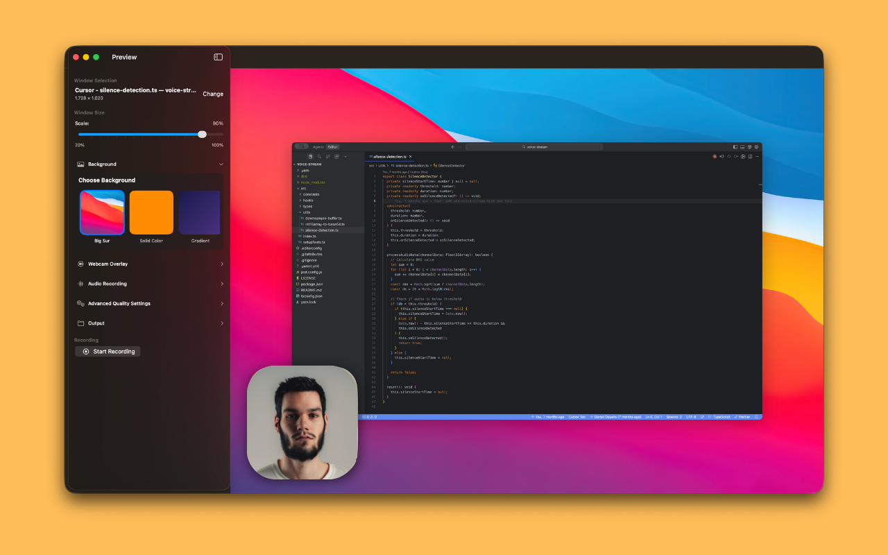

# EasyDemo - Screen Recorder

A free, open-source screen recorder for macOS. Professional-quality recordings shouldn't be behind a paywall. For those who want a quick styled screen recording.

## Description

**EasyDemo** is a macOS-native screen recording application built with Swift and SwiftUI that captures selected windows with custom backgrounds and webcam overlays, producing high-quality local recordings similar to Screen Studio or Loom—but completely free.

Born from the frustration of screen recorders being locked behind paywalls, EasyDemo provides creators, developers, and everyone a styled and quick way to record their screen without subscription fees or usage limits.

The app is designed with an **offline-first** philosophy—everything is processed locally using Apple frameworks (ScreenCaptureKit, AVFoundation, Core Image). No data leaves your device, ensuring complete privacy and security.

You can download it from the AppStore:

### Core Principles

- **Offline-first:** All processing happens locally—no cloud, no external dependencies
- **Native UX:** Built entirely with Swift + SwiftUI, tightly integrated with macOS
- **Professional Output:** Exported videos are high-quality and polished
- **Simplicity:** Choose window → customize → record → export

## Current Features

### Window Recording

- Select any active macOS window with live thumbnails
- Capture with native aesthetics (transparency, rounded corners, shadows)
- Real-time preview before recording
- High-quality 60fps recording using ScreenCaptureKit

### Background Customization

- Solid colors
- Linear gradients
- Custom images
- Blur effects from wallpaper

### Webcam Overlay

- 1080p camera capture using AVFoundation
- Shape masking: Circle, Rounded Rectangle, Squircle
- Customizable position and size
- Optional border effects
- Independent from window zoom/pan

### Video Export

- Multiple codec support: H.264, HEVC, ProRes
- Resolutions up to 4K
- Professional-grade output saved to `~/Movies/EasyDemo/`
- Playback preview after recording

### Permission Management

- Seamless screen recording permission flow
- Camera access for webcam overlay
- Privacy-focused with clear permission prompts

## System Requirements

- macOS 14.6 or later
- Screen Recording permission
- Camera access (for webcam overlay feature)

## Privacy & Security

All recording and processing happens **locally** on your Mac. No data is uploaded to any cloud service or external server. Your recordings are saved directly to your Movies folder with complete privacy.

---

Built with Swift, SwiftUI, and native Apple frameworks.
